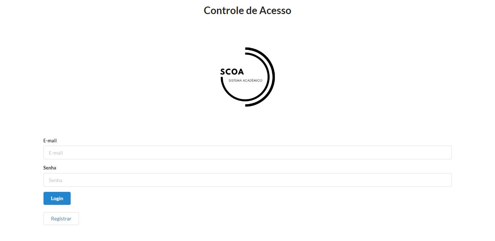
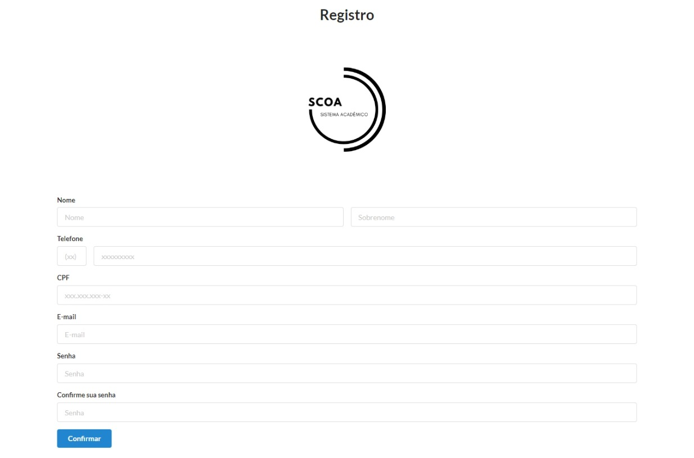
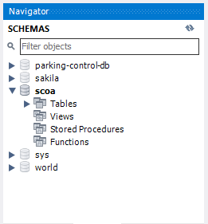
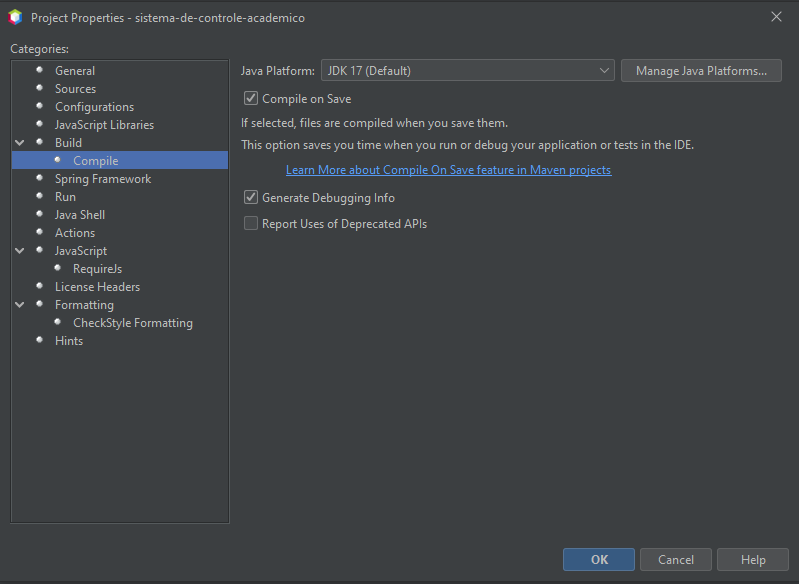
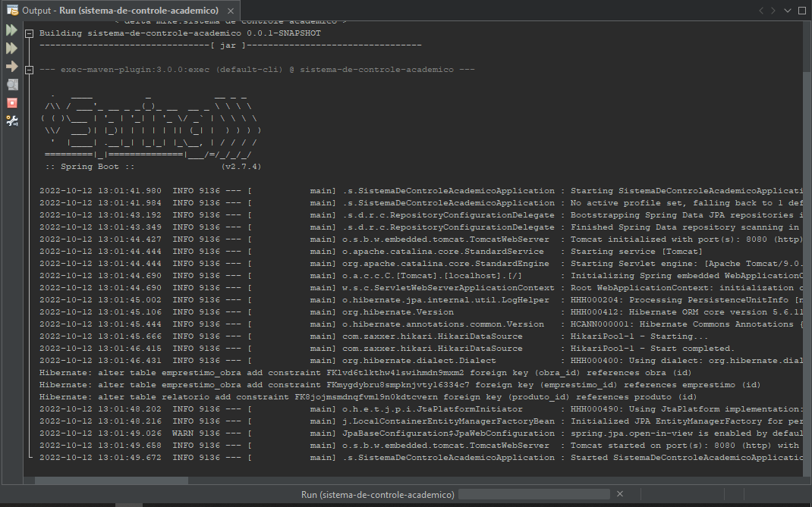
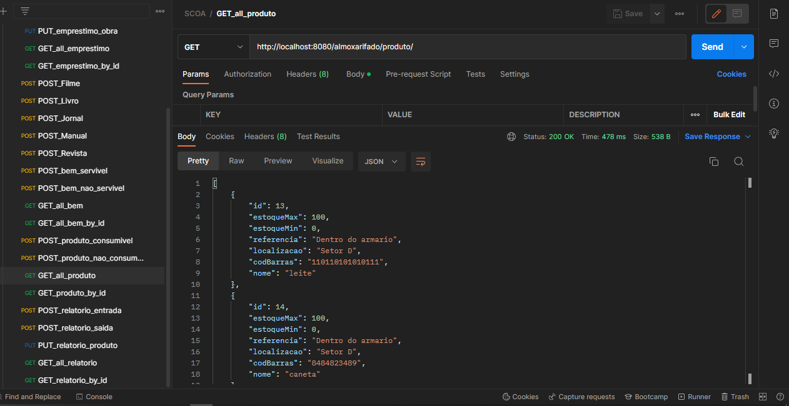
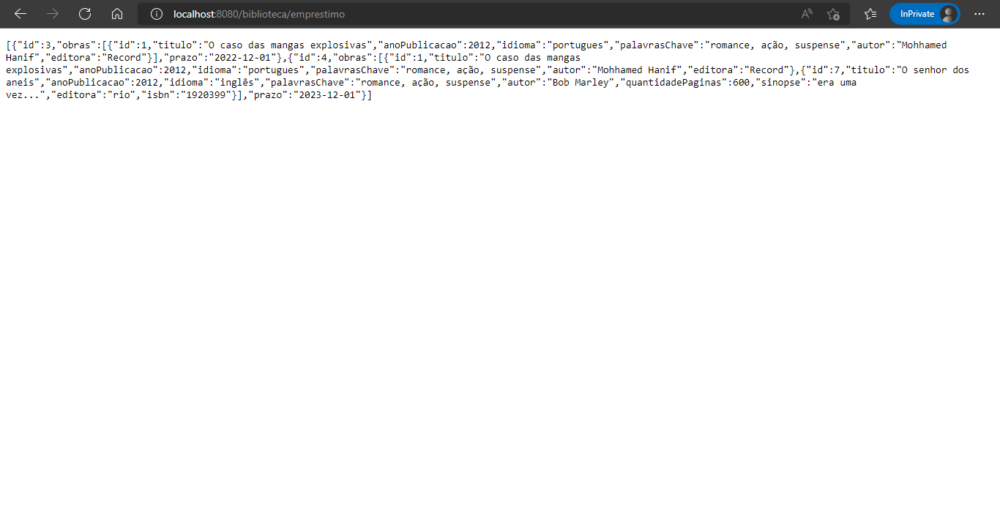

# SCOA

## Ferramentas utilizadas

- Apache Netbeans 15
- MySQL 80
- Java 17 JDK
- StarUML
- draw.io
- Postman

## Autores

- Igor Rodrigues
- Guilherme Francisco de Oliveira Almeida
- Raphael de Oliveira dos Santos
- Lucas de Mendonça Cardoso
- [Nome]

## Imagens

#### Tela de login

#### Tela de registro

#### Visão do Banco de dados

#### Configuração do NetBeans Java 17

#### Compilação bem sucedida

#### Usando a API com Postman

#### Usando a API com o navegador

## Referências

Recursos que auxiliaram no desenvolvimento deste projeto

- [Tutorial da Oracle sobre Herança de entidades](https://docs.oracle.com/javaee/6/tutorial/doc/bnbqn.html)
- [Thorben Janssen - Boas práticas para a implementação de relacões N-pra-N](https://thorben-janssen.com/hibernate-tips-the-best-way-to-remove-entities-from-a-many-to-many-association/)

